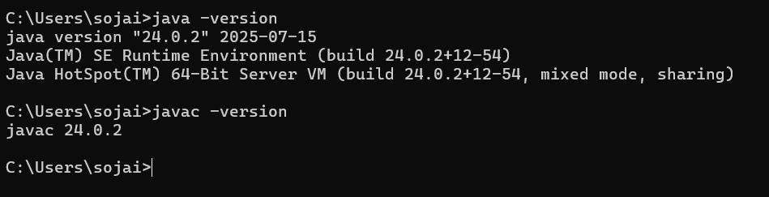

<div align="center">

<style>
  .main-title {
    font-family: 'Georgia', 'Times New Roman', serif;
    font-size: 3.2em;
    font-weig## <span class="section-header">📚 Evolution of Java</span>

<div style="background: linear-gradient(135deg, #ffecd2 0%, #fcb69f 100%); border-radius: 15px; padding: 25px; margin: 20px 0; box-shadow: 0 8px 32px rgba(0,0,0,0.1);">

### <span style="font-family: 'Palatino', serif; color: #d35400; font-size: 1.4em; font-weight: 600;">🕰️ Java Timeline - Key Milestones</span>

<div style="font-family: 'Georgia', serif; line-height: 1.8; color: #2c3e50; margin: 20px 0;">

<p style="margin: 12px 0;"><strong style="color: #e74c3c;">🌱 1991</strong>: Java project initiated at Sun Microsystems (initially called <em>"Oak"</em>)</p>

<p style="margin: 12px 0;"><strong style="color: #e74c3c;">🚀 1995</strong>: Java 1.0 released – <strong>"Write Once, Run Anywhere"</strong> philosophy established</p>

<p style="margin: 12px 0;"><strong style="color: #e74c3c;">📈 1997</strong>: Java 1.1 – Introduced inner classes, JavaBeans, and JDBC connectivity</p>0;
    background: linear-gradient(45deg, #667eea 0%, #764ba2 100%);
    -webkit-background-clip: text;
    -webkit-text-fill-color: transparent;
    text-shadow: 2px 2px 4px rgba(0,0,0,0.1);
    margin: 25px 0;
    letter-spacing: 1px;
  }
  .subtitle-fancy {
    font-family: 'Palatino', 'Book Antiqua', serif;
    font-size: 1.1em;
    color: #5d6d7e;
    font-style: italic;
    font-weight: 300;
    letter-spacing: 0.5px;
  }
  .section-header {
    font-family: 'Trebuchet MS', 'Lucida Sans Unicode', sans-serif;
    font-weight: 600;
    color: #2c3e50;
    text-transform: uppercase;
    letter-spacing: 1.5px;
    border-bottom: 3px solid #3498db;
    padding-bottom: 8px;
    margin: 30px 0 20px 0;
  }
  .description-text {
    font-family: 'Segoe UI', 'Roboto', 'Arial', sans-serif;
    font-size: 1.1em;
    line-height: 1.7;
    color: #34495e;
    text-align: justify;
    margin: 15px 0;
  }
  .feature-item {
    font-family: 'Verdana', 'Geneva', sans-serif;
    font-size: 1.05em;
    color: #2c3e50;
    line-height: 1.6;
    margin: 8px 0;
  }
</style>

# <span class="main-title">🎓 Campus Course & Records Manager</span>
### <span class="subtitle-fancy">( C C R M )</span>


</div>

---

## <span class="section-header">🌟 Project Overview</span>

<p class="description-text">The <strong>Campus Course & Records Manager (CCRM)</strong> is a sophisticated console-based Java SE application meticulously crafted to revolutionize academic operations for educational institutes. This comprehensive solution seamlessly integrates student management, course administration, enrollment tracking, grade processing, and transcript generation while providing robust data import/export and backup capabilities.</p>

<p class="description-text">This project exemplifies the application of advanced <em>Object-Oriented Programming (OOP)</em> principles, cutting-edge Java features including <strong>Streams API</strong>, <strong>Enums</strong>, and <strong>NIO.2</strong>, combined with proven design patterns to construct a resilient and highly maintainable system architecture.</p>

## <span class="section-header">✨ Key Features</span>

<div style="background: linear-gradient(135deg, #f5f7fa 0%, #c3cfe2 100%); border-radius: 15px; padding: 25px; margin: 20px 0; box-shadow: 0 8px 32px rgba(0,0,0,0.1);">

<p class="feature-item"><strong>🎓 Student Management</strong>: Create, update, and manage comprehensive student profiles with advanced enrollment status tracking</p>

<p class="feature-item"><strong>📚 Course Management</strong>: Handle sophisticated course creation, updates, and instructor assignments with validation</p>

<p class="feature-item"><strong>📝 Enrollment System</strong>: Manage student course enrollments with comprehensive business rule validation and conflict detection</p>

<p class="feature-item"><strong>🏆 Grading & Transcripts</strong>: Record grades with precision, calculate GPA automatically, and generate professional academic transcripts</p>

<p class="feature-item"><strong>💾 File Operations</strong>: Import/export data via CSV files with robust backup and archival capabilities using modern NIO.2</p>

<p class="feature-item"><strong>📊 Reporting</strong>: Generate comprehensive academic reports utilizing the powerful Java Stream API for data processing</p>

</div>

## <span class="section-header">🚀 How to Run</span>

<div style="background: linear-gradient(135deg, #667eea 0%, #764ba2 100%); border-radius: 15px; padding: 2px; margin: 20px 0;">
<div style="background: white; border-radius: 13px; padding: 20px;">

### <span style="font-family: 'Consolas', 'Monaco', monospace; color: #8e44ad; font-weight: 600;">⚙️ Prerequisites</span>

<table style="font-family: 'Segoe UI', sans-serif; border-collapse: collapse; width: 100%; margin: 15px 0;">
<tr style="background: linear-gradient(135deg, #f093fb 0%, #f5576c 100%); color: white;">
<td style="padding: 12px; font-weight: 600; border-radius: 8px 0 0 0;">Component</td>
<td style="padding: 12px; font-weight: 600; border-radius: 0 8px 0 0;">Requirement</td>
</tr>
<tr style="background: #f8f9fa;">
<td style="padding: 10px; font-weight: 500; color: #2c3e50;">🔧 <strong>JDK Version</strong></td>
<td style="padding: 10px; color: #34495e; font-family: 'Consolas', monospace;">Java 11 or higher</td>
</tr>
<tr style="background: white;">
<td style="padding: 10px; font-weight: 500; color: #2c3e50;">💻 <strong>IDE</strong></td>
<td style="padding: 10px; color: #34495e;">Eclipse IDE for Java Developers (recommended)</td>
</tr>
<tr style="background: #f8f9fa;">
<td style="padding: 10px; font-weight: 500; color: #2c3e50;">🖥️ <strong>Operating System</strong></td>
<td style="padding: 10px; color: #34495e;">Windows 10/11 (installation guide provided)</td>
</tr>
</table>

### <span style="font-family: 'Consolas', 'Monaco', monospace; color: #27ae60; font-weight: 600;">🏃‍♂️ Running the Application</span>

<div style="background: #2c3e50; border-radius: 10px; padding: 20px; margin: 15px 0; color: #ecf0f1; font-family: 'Consolas', 'Monaco', monospace; box-shadow: 0 4px 15px rgba(0,0,0,0.2);">

**1. Clone the repository:**
```bash
git clone https://github.com/Soham-0707/CCRM.git
cd CCRM
```

**2. Compile the project:**
```bash
javac -d bin src/edu/ccrm/**/*.java
```

**3. Run the application:**
```bash
java -cp bin edu.ccrm.CCRMApplication
```

**4. Enable Assertions** (recommended for testing):
```bash
java -ea -cp bin edu.ccrm.CCRMApplication
```

</div>

</div>
</div>

## Evolution of Java

### Java Timeline - Key Milestones
- **1991**: Java project initiated at Sun Microsystems (initially called “Oak”)
- **1995**: Java 1.0 released – “Write Once, Run Anywhere” 
- **1997**: Java 1.1 – Introduced inner classes, JavaBeans, JDBC
<p style="margin: 12px 0;"><strong style="color: #e74c3c;">⚡ 1998</strong>: Java 2 (J2SE 1.2) – Collections framework, Swing GUI toolkit introduced</p>

<p style="margin: 12px 0;"><strong style="color: #e74c3c;">🔥 2000</strong>: J2SE 1.3 – HotSpot JVM revolutionizes performance, Java Sound API</p>

<p style="margin: 12px 0;"><strong style="color: #e74c3c;">🔧 2002</strong>: J2SE 1.4 – Regular expressions, NIO, comprehensive XML processing</p>

<p style="margin: 12px 0;"><strong style="color: #e74c3c;">✨ 2004</strong>: Java 5 (J2SE 1.5) – <strong>Generics</strong>, annotations, enums, enhanced for-loop</p>

<p style="margin: 12px 0;"><strong style="color: #e74c3c;">🚄 2006</strong>: Java 6 (J2SE 6) – Major performance improvements, scripting support</p>

<p style="margin: 12px 0;"><strong style="color: #e74c3c;">💎 2011</strong>: Java 7 – Diamond operator, try-with-resources, <strong>NIO.2</strong></p>

<p style="margin: 12px 0;"><strong style="color: #e74c3c;">🌊 2014</strong>: Java 8 – <strong>Lambda expressions</strong>, Stream API, functional interfaces</p>

<p style="margin: 12px 0;"><strong style="color: #e74c3c;">🏗️ 2017</strong>: Java 9 – Module system, JShell, reactive streams</p>

<p style="margin: 12px 0;"><strong style="color: #e74c3c;">🎯 2018</strong>: Java 10-11 – <strong>LTS release</strong>, local variable type inference (var), HTTP client</p>

<p style="margin: 12px 0;"><strong style="color: #e74c3c;">🔄 2019-2024</strong>: Java 12-21 – Switch expressions, text blocks, records, sealed classes, <strong>virtual threads</strong></p>

</div>

</div>

## <span class="section-header">🏛️ Java Editions Comparison</span>

<div style="overflow-x: auto; margin: 20px 0;">
<table style="width: 100%; border-collapse: collapse; font-family: 'Segoe UI', sans-serif; box-shadow: 0 4px 20px rgba(0,0,0,0.1); border-radius: 12px; overflow: hidden;">

<thead>
<tr style="background: linear-gradient(135deg, #667eea 0%, #764ba2 100%); color: white;">
<th style="padding: 15px; text-align: left; font-weight: 600; font-size: 1.1em;">🏷️ Feature</th>
<th style="padding: 15px; text-align: left; font-weight: 600; font-size: 1.1em;">📱 Java ME<br/><span style="font-size: 0.9em; font-weight: 400;">(Micro Edition)</span></th>
<th style="padding: 15px; text-align: left; font-weight: 600; font-size: 1.1em;">💻 Java SE<br/><span style="font-size: 0.9em; font-weight: 400;">(Standard Edition)</span></th>
<th style="padding: 15px; text-align: left; font-weight: 600; font-size: 1.1em;">🏢 Java EE<br/><span style="font-size: 0.9em; font-weight: 400;">(Enterprise Edition)</span></th>
</tr>
</thead>

<tbody>
<tr style="background: #f8f9fa;">
<td style="padding: 12px; font-weight: 600; color: #2c3e50; border-bottom: 1px solid #ecf0f1;">🎯 <strong>Target Platform</strong></td>
<td style="padding: 12px; color: #34495e; border-bottom: 1px solid #ecf0f1;">Mobile devices, embedded systems</td>
<td style="padding: 12px; color: #34495e; border-bottom: 1px solid #ecf0f1; background: linear-gradient(135deg, #a8e6cf 0%, #dcedc8 100%); font-weight: 500;"><strong>Desktop apps, servers</strong></td>
<td style="padding: 12px; color: #34495e; border-bottom: 1px solid #ecf0f1;">Enterprise web applications</td>
</tr>

<tr style="background: white;">
<td style="padding: 12px; font-weight: 600; color: #2c3e50; border-bottom: 1px solid #ecf0f1;">📊 <strong>Application Types</strong></td>
<td style="padding: 12px; color: #34495e; border-bottom: 1px solid #ecf0f1;">Mobile apps, IoT devices</td>
<td style="padding: 12px; color: #34495e; border-bottom: 1px solid #ecf0f1; background: linear-gradient(135deg, #a8e6cf 0%, #dcedc8 100%); font-weight: 500;"><strong>Standalone applications</strong></td>
<td style="padding: 12px; color: #34495e; border-bottom: 1px solid #ecf0f1;">Web services, enterprise apps</td>
</tr>

</tbody>
</table>
</div>
| **Core APIs** | Limited Java APIs| Complete Java API set | Java SE + additional enterprise APIs |
| **Memory Footprint** | Very small (KBs to a few MBs)| Moderate (10s to 100s of MBs) | Large (100s of MBs to GBs)           |
| **Key Technologies** | CLDC, MIDP, CDC            | Swing, AWT, NIO, Collections | Servlets, JSP, EJB, JPA, CDI         |
| **Examples** | Feature phones, smart cards | NetBeans, Eclipse | Banking systems, e-commerce          |
<tr style="background: #f8f9fa;">
<td style="padding: 12px; font-weight: 600; color: #2c3e50; border-bottom: 1px solid #ecf0f1;">📈 <strong>Status</strong></td>
<td style="padding: 12px; color: #e74c3c; border-bottom: 1px solid #ecf0f1; font-style: italic;">Legacy (discontinued)</td>
<td style="padding: 12px; color: #27ae60; border-bottom: 1px solid #ecf0f1; background: linear-gradient(135deg, #a8e6cf 0%, #dcedc8 100%); font-weight: 500;"><strong>✅ Active development</strong></td>
<td style="padding: 12px; color: #f39c12; border-bottom: 1px solid #ecf0f1;">Managed by Eclipse Foundation</td>
</tr>

</tbody>
</table>
</div>

## <span class="section-header">🏗️ Java Architecture: JDK, JRE, JVM</span>

<div style="display: grid; grid-template-columns: repeat(auto-fit, minmax(300px, 1fr)); gap: 20px; margin: 20px 0;">

<div style="background: linear-gradient(135deg, #ff9a9e 0%, #fecfef 100%); border-radius: 15px; padding: 20px; box-shadow: 0 8px 32px rgba(0,0,0,0.1);">
<h3 style="font-family: 'Trebuchet MS', sans-serif; color: #2c3e50; margin-bottom: 15px;">⚙️ Java Virtual Machine (JVM)</h3>
<p style="font-family: 'Segoe UI', sans-serif; color: #2c3e50; line-height: 1.6; margin-bottom: 10px;">The <strong>JVM</strong> executes Java bytecode and provides:</p>
<ul style="font-family: 'Segoe UI', sans-serif; color: #34495e; line-height: 1.6;">
<li><strong>🌐 Platform Independence</strong> – Same bytecode runs on multiple OS</li>
<li><strong>🗑️ Memory Management</strong> – Automatic garbage collection</li>
<li><strong>🛡️ Security</strong> – Sandbox environment for code execution</li>
<li><strong>⚡ Performance</strong> – JIT compilation for optimization</li>
</ul>
</div>

<div style="background: linear-gradient(135deg, #a8edea 0%, #fed6e3 100%); border-radius: 15px; padding: 20px; box-shadow: 0 8px 32px rgba(0,0,0,0.1);">
<h3 style="font-family: 'Trebuchet MS', sans-serif; color: #2c3e50; margin-bottom: 15px;">🏃‍♂️ Java Runtime Environment (JRE)</h3>
<p style="font-family: 'Segoe UI', sans-serif; color: #2c3e50; line-height: 1.6; margin-bottom: 10px;">The <strong>JRE</strong> contains everything required to run Java programs:</p>
<ul style="font-family: 'Segoe UI', sans-serif; color: #34495e; line-height: 1.6;">
<li><strong>⚙️ JVM</strong> – Core execution engine</li>
<li><strong>📚 Core Libraries</strong> – Essential APIs (java.lang, java.util, etc.)</li>
<li><strong>📁 Supporting Files</strong> – Configuration and resource files</li>
<li style="background: #fff3cd; padding: 5px; border-radius: 5px; margin: 5px 0; border-left: 4px solid #ffc107;"><strong>📝 Note</strong>: JRE = JVM + Core Libraries + Other Components</li>
</ul>
</div>

<div style="background: linear-gradient(135deg, #ffecd2 0%, #fcb69f 100%); border-radius: 15px; padding: 20px; box-shadow: 0 8px 32px rgba(0,0,0,0.1);">
<h3 style="font-family: 'Trebuchet MS', sans-serif; color: #2c3e50; margin-bottom: 15px;">🛠️ Java Development Kit (JDK)</h3>
<p style="font-family: 'Segoe UI', sans-serif; color: #2c3e50; line-height: 1.6; margin-bottom: 10px;">The <strong>JDK</strong> is the complete development environment:</p>
<ul style="font-family: 'Segoe UI', sans-serif; color: #34495e; line-height: 1.6;">
<li><strong>🏃‍♂️ Includes JRE</strong> – Complete runtime environment</li>
<li><strong>🔧 Development Tools</strong>: javac, jdb, javadoc</li>
<li><strong>🧰 Additional Utilities</strong>: JAR tools, monitoring, profiling tools</li>
<li style="background: #d1ecf1; padding: 5px; border-radius: 5px; margin: 5px 0; border-left: 4px solid #17a2b8;"><strong>💡 Note</strong>: JDK = JRE + Development Tools</li>
</ul>
</div>

</div>

### <span style="font-family: 'Consolas', monospace; color: #8e44ad; font-size: 1.3em;">🔄 Interaction Flow</span>

<div style="background: #2c3e50; border-radius: 12px; padding: 20px; margin: 20px 0; color: #ecf0f1; font-family: 'Consolas', 'Monaco', monospace; font-size: 1.1em; text-align: center; box-shadow: 0 8px 32px rgba(0,0,0,0.2);">
<div style="line-height: 2; letter-spacing: 1px;">
📝 <strong>Source Code (.java)</strong> 
<br/>⬇️ <span style="color: #3498db;">[javac]</span> ⬇️
<br/>🎯 <strong>Bytecode (.class)</strong>
<br/>⬇️ <span style="color: #e74c3c;">[JVM]</span> ⬇️
<br/>⚡ <strong>Native Machine Code</strong>
<br/>⬇️
<br/>🚀 <strong>Execution</strong>
</div>
</div>

<div style="background: linear-gradient(135deg, #667eea 0%, #764ba2 100%); border-radius: 15px; padding: 20px; margin: 20px 0; color: white;">
<h4 style="color: #f8f9fa; font-family: 'Trebuchet MS', sans-serif; margin-bottom: 15px;">📋 Process Breakdown:</h4>
<ol style="font-family: 'Segoe UI', sans-serif; line-height: 1.8; font-size: 1.05em;">
<li><strong>🛠️ Development</strong>: Write Java source code using JDK tools</li>
<li><strong>⚙️ Compilation</strong>: javac compiler converts source to platform-neutral bytecode</li>
<li><strong>🎯 Execution</strong>: JVM loads bytecode and converts to native machine code</li>
<li><strong>🚀 Runtime</strong>: Application runs with JRE providing necessary libraries and services</li>
</ol>
</div>

## <span class="section-header">🖥️ Java Installation on Windows</span>

<div style="background: linear-gradient(135deg, #667eea 0%, #764ba2 100%); border-radius: 15px; padding: 2px; margin: 20px 0;">
<div style="background: white; border-radius: 13px; padding: 25px;">

### <span style="font-family: 'Georgia', serif; color: #8e44ad; font-size: 1.4em; font-weight: 600;">📋 Step-by-Step Installation Guide</span>

<div style="display: grid; grid-template-columns: repeat(auto-fit, minmax(300px, 1fr)); gap: 20px; margin: 25px 0;">

<div style="background: linear-gradient(135deg, #ff9a9e 0%, #fecfef 100%); border-radius: 12px; padding: 20px; box-shadow: 0 4px 15px rgba(0,0,0,0.1);">
<h4 style="color: #2c3e50; font-family: 'Trebuchet MS', sans-serif; margin-bottom: 15px;">📥 Step 1: Download JDK</h4>
<ol style="font-family: 'Segoe UI', sans-serif; color: #34495e; line-height: 1.6;">
<li>Visit <a href="https://www.oracle.com/java/technologies/downloads/" style="color: #3498db; text-decoration: none; font-weight: 500;">Oracle JDK Downloads</a> or <a href="https://openjdk.org/" style="color: #e74c3c; text-decoration: none; font-weight: 500;">OpenJDK</a></li>
<li>Select <strong>Windows x64 Installer</strong> for your version (Java 11+ recommended)</li>
<li>Download the <code style="background: #2c3e50; color: white; padding: 2px 6px; border-radius: 4px; font-family: 'Consolas', monospace;">.exe</code> file</li>
</ol>
</div>

<div style="background: linear-gradient(135deg, #a8edea 0%, #fed6e3 100%); border-radius: 12px; padding: 20px; box-shadow: 0 4px 15px rgba(0,0,0,0.1);">
<h4 style="color: #2c3e50; font-family: 'Trebuchet MS', sans-serif; margin-bottom: 15px;">🔧 Step 2: Install JDK</h4>
<ol style="font-family: 'Segoe UI', sans-serif; color: #34495e; line-height: 1.6;">
<li>Run the downloaded installer <strong>as Administrator</strong></li>
<li>Follow installation wizard (accept default paths)</li>
<li>Installation typically goes to<br/><code style="background: #2c3e50; color: white; padding: 2px 6px; border-radius: 4px; font-family: 'Consolas', monospace; font-size: 0.9em;">C:\Program Files\Java\jdk-[version]</code></li>
</ol>
</div>

</div>

<div style="background: linear-gradient(135deg, #ffecd2 0%, #fcb69f 100%); border-radius: 12px; padding: 20px; margin: 20px 0; box-shadow: 0 4px 15px rgba(0,0,0,0.1);">
<h4 style="color: #2c3e50; font-family: 'Trebuchet MS', sans-serif; margin-bottom: 15px;">🌐 Step 3: Set Environment Variables</h4>
<ol style="font-family: 'Segoe UI', sans-serif; color: #34495e; line-height: 1.6;">
<li>Open <strong>System Properties</strong> → <strong>Advanced</strong> → <strong>Environment Variables</strong></li>
<li><strong>Create JAVA_HOME variable:</strong>
   <ul style="margin: 10px 0;">
   <li>Variable name: <code style="background: #27ae60; color: white; padding: 2px 6px; border-radius: 4px; font-family: 'Consolas', monospace;">JAVA_HOME</code></li>
   <li>Variable value: <code style="background: #e74c3c; color: white; padding: 2px 6px; border-radius: 4px; font-family: 'Consolas', monospace;">C:\Program Files\Java\jdk-[version]</code></li>
   </ul>
</li>
<li><strong>Update PATH variable:</strong>
   <ul style="margin: 10px 0;">
   <li>Add <code style="background: #8e44ad; color: white; padding: 2px 6px; border-radius: 4px; font-family: 'Consolas', monospace;">%JAVA_HOME%\bin</code> to the PATH</li>
   </ul>
</li>
</ol>
</div>

<div style="background: #2c3e50; border-radius: 12px; padding: 20px; margin: 20px 0; color: #ecf0f1;">
<h4 style="color: #3498db; font-family: 'Trebuchet MS', sans-serif; margin-bottom: 15px;">✅ Step 4: Verify Installation</h4>
<p style="font-family: 'Segoe UI', sans-serif; margin-bottom: 10px;">Open Command Prompt and run:</p>
<div style="background: #34495e; padding: 15px; border-radius: 8px; font-family: 'Consolas', monospace; margin: 10px 0;">
<div style="color: #2ecc71;">java -version</div>
<div style="color: #e74c3c;">javac -version</div>
</div>
</div>

<div style="text-align: center; margin: 25px 0; padding: 20px; background: linear-gradient(135deg, #667eea 0%, #764ba2 100%); border-radius: 12px; color: white;">
<h4 style="margin-bottom: 15px; font-family: 'Trebuchet MS', sans-serif;">📸 Installation Verification Screenshot</h4>
<p style="font-family: 'Segoe UI', sans-serif; margin-bottom: 10px;"><em>Java Version Check Confirmation</em></p>
<div style="background: rgba(255,255,255,0.1); padding: 8px; border-radius: 6px; display: inline-block;">

</div>
</div>

</div>
</div>

## <span class="section-header">🚀 Eclipse IDE Setup</span>

### Installation Steps
1. Download **Eclipse IDE for Java Developers** from [eclipse.org](https://www.eclipse.org/downloads/)
2. Extract the downloaded archive to desired location

### Creating New Java Project
1. **File** → **New** → **Java Project**
2. Project name: `CCRM`
3. Use default JRE (should match your installed JDK)
4. Create `src` folder structure with packages

**Screenshot: Eclipse Project Setup**

*Figure 2: Creating new Java project in Eclipse IDE*

### Run Configuration
1. Right-click on main class → **Run As** → **Java Application**
2. Configure run arguments if needed
3. Set up assertions: **Run Configurations** → **Arguments** → **VM arguments**: `-ea`

**Screenshot: Eclipse Run Configuration**

*Figure 3: Configuring run settings in Eclipse*

## Technical Implementation Mapping

| Syllabus Topic | Implementation Location | Description |
|----------------|--------------------|-------------|
| **OOP - Encapsulation** | `edu.ccrm.domain.*`| Fields are private, access via getters/setters|
| **OOP - Inheritance** | `edu.ccrm.domain.Person` → `Student`, `Instructor` | Abstract class Person extended by concrete entities|
| **OOP - Abstraction** | `edu.ccrm.domain.Person` |Abstract methods like `getRole()`, `displayInfo()`|
| **OOP - Polymorphism** | `edu.ccrm.service.*` interfaces | Interface methods with multiple implementations|
| **Interfaces** | `edu.ccrm.service.Persistable` | Generic interface with default methods |
| **Enums** | `edu.ccrm.domain.Grade`, `Semester` | Enums with constructors and fields |
| **Exception Handling** | `edu.ccrm.exception.*` | Custom exceptions: DuplicateEnrollmentException, MaxCreditLimitExceededException |
| **Collections Framework** | `StudentService`, `CourseService` | Use of HashMap, List for storage|
| **Generics** | `Persistable<T>` interface | Generic interface and method parameters |
| **Lambda Expressions** | `edu.ccrm.util.Comparators` | Sorting and filtering with Lambdas|
| **Stream API** | `TranscriptService.generateReports()` | GPA calculations, filtering, data aggregation |
| **Date/Time API** | `edu.ccrm.domain.Student` | Using LocalDateTime for enrollment|
| **NIO.2** | `edu.ccrm.io.ImportExportService` | File operations with Path, Files APIs|
| **Recursion** | `edu.ccrm.util.RecursiveUtils` | Directory size calculation, file tree traversal |
| **Design Patterns - Singleton** | `edu.ccrm.config.AppConfig` | Thread-safe singleton implementation |
| **Design Patterns - Builder** | `edu.ccrm.domain.Course.Builder` | Constructing courses using Builder|
| **Nested Classes** | `Course.Builder` (static), `TranscriptGenerator.ReportFormatter` (inner) | Static nested and inner class examples |
| **Anonymous Classes** | `MainMenu.createComparator()` | Anonymous Comparator implementation |
| **Assertions** | Throughout service classes | Validate preconditions and invariants|

## Package Structure and Architecture

```
src/edu/ccrm/
├── cli/                           # Command Line Interface
│   ├── MainMenu.java             # Main menu system with switch statements
│   ├── StudentMenuHandler.java   # Student-specific operations
│   └── CourseMenuHandler.java    # Course-specific operations
├── domain/                        # Domain Models
│   ├── Person.java               # Abstract base class
│   ├── Student.java              # Student entity (extends Person)
│   ├── Instructor.java           # Instructor entity (extends Person)
│   ├── Course.java               # Course entity with Builder pattern
│   ├── Enrollment.java           # Enrollment relationship
│   ├── Grade.java                # Grade enum with grade points
│   ├── Semester.java             # Semester enum
│   └── CourseCode.java           # Immutable value object
├── service/                       # Business Logic Layer
│   ├── Persistable.java          # Generic persistence interface
│   ├── StudentService.java       # Student CRUD operations
│   ├── CourseService.java        # Course CRUD operations
│   ├── EnrollmentService.java    # Enrollment business rules
│   └── TranscriptService.java    # GPA calculation, transcript generation
├── io/                            # File Operations
│   ├── ImportExportService.java  # CSV import/export with NIO.2
│   ├── BackupService.java        # Backup operations with timestamping
│   └── CSVParser.java            # CSV parsing utilities
├── util/                          # Utilities
│   ├── Validators.java           # Input validation methods
│   ├── Comparators.java          # Lambda-based comparators
│   └── RecursiveUtils.java       # Recursive file operations
├── config/                        # Configuration
│   ├── AppConfig.java            # Singleton configuration
│   └── DatabaseConfig.java       # Data persistence settings
├── exception/                     # Custom Exceptions
│   ├── DuplicateEnrollmentException.java    # Checked exception
│   ├── MaxCreditLimitExceededException.java # Runtime exception
│   └── InvalidGradeException.java           # Validation exception
└── CCRMApplication.java           # Main application entry point
```

## Enabling Assertions

Assertions are used throughout the application to verify invariants and preconditions. To enable assertions:

### Command Line
```bash
# Enable all assertions
java -ea edu.ccrm.CCRMApplication

# Enable for specific package
java -ea:edu.ccrm.domain... edu.ccrm.CCRMApplication

# Enable system assertions
java -esa edu.ccrm.CCRMApplication
```

### Eclipse IDE
1. **Run** → **Run Configurations**
2. Select your configuration → **Arguments** tab
3. In **VM arguments**, add: `-ea`

### Example Assertion Usage
```java
// In StudentService.java
public void enrollStudent(String studentId, String courseCode) {
    assert studentId != null && !studentId.trim().isEmpty() : "Student ID cannot be null or empty";
    assert courseCode != null && !courseCode.trim().isEmpty() : "Course code cannot be null or empty";
    
    Student student = findById(studentId);
    assert student != null : "Student must exist before enrollment";
    
    // Business logic continues...
}
```

## Sample Commands and Usage

### Basic Operations
```bash
# Start application
java -ea -cp bin edu.ccrm.CCRMApplication

# Menu navigation examples:
# 1. Manage Students
# 2. Manage Courses  
# 3. Enrollment Operations
# 4. Grade Management
# 5. Reports and Transcripts
# 6. File Operations
# 7. Backup and Recovery
# 0. Exit
```

### File Operations Examples
The application supports importing/exporting data through CSV files:

**Sample Student CSV Format:**
```csv
id,regNo,fullName,email,status
STU001,2023001,John Doe,john.doe@university.edu,ACTIVE
STU002,2023002,Jane Smith,jane.smith@university.edu,ACTIVE
```

**Sample Course CSV Format:**
```csv
code,title,credits,instructor,semester,department
CS101,Introduction to Programming,3,Dr. Johnson,FALL,Computer Science
MATH201,Calculus II,4,Prof. Anderson,SPRING,Mathematics
```

## Project Demonstration Flow

When you run the application, you'll experience:

1.	AppConfig loads configuration
2.	Main menu appears
3.	Manage students
4.	Manage courses with Builder and Stream API
5.	Enroll students with business validation
6.	Record grades and compute GPA
7.	Import/export files
8.	Backup system creates timestamped backups
9.	Generate reports using Stream API
10.	Show Java SE vs ME vs EE summary

## Test Data

The project includes sample test data in the `test-data/` directory:
- `students.csv`: Sample student records for import testing
- `courses.csv`: Sample course data with various departments
- `enrollments.csv`: Sample enrollment records

## Technical Notes

### Java Platform Summary
This application demonstrates **Java SE (Standard Edition)** capabilities:
- **Java SE**: Provides core APIs for desktop applications, server-side development
- **Java ME**: Designed for resource-constrained devices (legacy)  
- **Java EE**: Enterprise features for web applications and distributed systems

### Performance Considerations
- Uses HashMap for O(1) lookup performance in services
- Stream API for efficient data processing and filtering
- NIO.2 for improved file I/O performance
- 💤 Lazy initialization in Singleton pattern

### <span style="font-family: 'Trebuchet MS', sans-serif; color: #8e44ad;">🔮 Future Enhancements</span>
- 🗄️ Database persistence with JDBC
- 🖥️ GUI interface using JavaFX or Swing  
- 🌐 RESTful API endpoints for web integration
- 📊 Advanced reporting with data visualization

---

## <span class="section-header">🙏 Acknowledgments</span>

<div style="background: linear-gradient(135deg, #667eea 0%, #764ba2 100%); border-radius: 15px; padding: 25px; margin: 20px 0; color: white; text-align: center;">

<p style="font-family: 'Georgia', serif; font-size: 1.1em; line-height: 1.7; margin-bottom: 20px;">This project was developed as part of <strong>Java Programming coursework</strong>, demonstrating comprehensive usage of Java SE features, OOP principles, and software engineering best practices. All code is original implementation following academic integrity guidelines.</p>

<div style="background: rgba(255,255,255,0.1); border-radius: 10px; padding: 20px; margin: 20px 0;">
<h4 style="color: #f8f9fa; font-family: 'Trebuchet MS', sans-serif; margin-bottom: 15px;">📚 References</h4>
<ul style="list-style: none; padding: 0; font-family: 'Segoe UI', sans-serif; line-height: 1.6;">
<li>📖 Oracle Java Documentation</li>
<li>⚡ Java SE API Specification</li>
<li>💎 Effective Java by Joshua Bloch</li>
<li>📘 Java: The Complete Reference by Herbert Schildt</li>
</ul>
</div>

</div>

---

<div style="background: linear-gradient(135deg, #ffecd2 0%, #fcb69f 100%); border-radius: 15px; padding: 20px; margin: 20px 0; text-align: center;">

<h3 style="color: #d35400; font-family: 'Georgia', serif; margin-bottom: 20px;">👨‍💻 Developer Information</h3>

<table style="margin: 0 auto; font-family: 'Segoe UI', sans-serif; border-collapse: collapse;">
<tr><td style="padding: 8px; color: #2c3e50; font-weight: 600;">👤 <strong>Author</strong>:</td><td style="padding: 8px; color: #34495e;">Harshvardhan Singh Jaisawat</td></tr>
<tr><td style="padding: 8px; color: #2c3e50; font-weight: 600;">🎓 <strong>Reg. No.</strong>:</td><td style="padding: 8px; color: #34495e;">24BCE11064</td></tr>
<tr><td style="padding: 8px; color: #2c3e50; font-weight: 600;">📚 <strong>Course</strong>:</td><td style="padding: 8px; color: #34495e;">Programming in Java</td></tr>
<tr><td style="padding: 8px; color: #2c3e50; font-weight: 600;">🏛️ <strong>Institution</strong>:</td><td style="padding: 8px; color: #34495e;">Vellore Institute of Technology, Bhopal</td></tr>
<tr><td style="padding: 8px; color: #2c3e50; font-weight: 600;">📅 <strong>Date</strong>:</td><td style="padding: 8px; color: #34495e;">15-09-2025</td></tr>
<tr><td style="padding: 8px; color: #2c3e50; font-weight: 600;">🔢 <strong>Version</strong>:</td><td style="padding: 8px; color: #34495e;">1.0</td></tr>
</table>

</div>

<div align="center" style="margin: 30px 0; font-family: 'Georgia', serif;">
<h4 style="color: #7f8c8d;">⭐ If this project helped you, please give it a star! ⭐</h4>
</div>
